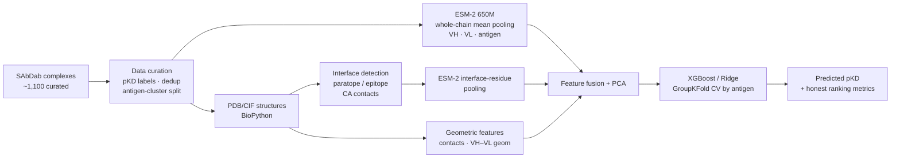

# AbDock-AI — Antibody–Antigen Binding Affinity Prediction

A machine-learning pipeline that predicts **antibody–antigen binding affinity (pKD)** from
sequence and 3D structure. Binding affinity is the central quantity optimized during
**antibody affinity maturation** — the lead-optimization step of antibody drug discovery —
so a model that ranks binders reliably can reduce costly wet-lab iterations.

> **Headline result:** Spearman **0.41** on a *leakage-free antigen-cluster split*
> (held-out antigens the model never saw during training), up from ≈0 for the initial
> pipeline. The emphasis of this project is a **rigorous, honestly-evaluated** pipeline
> rather than an inflated benchmark number.

**Stack:** Python · PyTorch · ESM-2 (650M) · XGBoost · scikit-learn · BioPython · pandas/NumPy

---

## Why this is hard (and why the evaluation matters)

Predicting *absolute* binding affinity across *diverse* antigens from sequence is one of the
hardest tasks in the field. The common trap is to evaluate on a **random split**, where
near-identical antibodies leak between train and test and inflate the score. This project
found and corrected exactly that failure mode:

| Evaluation setting | Reported R² | Verdict |
| --- | --- | --- |
| Random split (naïve) | ~0.50 | ❌ Data leakage — antibody families shared across train/test |
| Antigen-cluster split (honest) | 0.16 (Spearman **0.41**) | ✅ Reflects true generalization to unseen antigens |

Knowing the gap between these two numbers is the difference between a demo and a
deployable model.

---

## Method



**Two complementary sequence representations**

- **Whole-chain mean pooling** — mean of ESM-2 per-residue embeddings over the full VH, VL,
  and antigen chains.
- **Interface-residue pooling** — ESM-2 embeddings pooled over *only* the paratope
  (antibody residues at the interface) and epitope (antigen residues at the interface),
  identified from the 3D structure. Sequence and structure indices are kept naturally
  aligned, so no external numbering map is required.

**Structural features** — interface residue/contact counts (CA < 8 Å, heavy < 5 Å),
chain sizes, and VH–VL geometry, extracted from PDB/CIF with BioPython.

---

## Results

Honest evaluation on the **antigen-cluster test split**, after de-duplication
(758 unique complexes → 608 train / 150 test), XGBoost + PCA(50):

| Feature set | Spearman | Pearson | R² |
| --- | :---: | :---: | :---: |
| Structural features only | 0.189 | 0.173 | −0.04 |
| Interface-residue pooling (paratope + epitope) | 0.251 | 0.243 | 0.01 |
| Whole-chain mean pooling (VH + VL + antigen) | 0.393 | 0.385 | 0.15 |
| Mean pooling + structural features | 0.375 | 0.371 | 0.13 |
| **Mean pooling + interface pooling (fused)** | **0.413** | **0.405** | **0.16** |

**Findings**

- The largest gain came from **fixing evaluation and data hygiene** (a prediction-alignment
  bug, sequence-based de-duplication, and stronger regularization), which moved the honest
  held-out correlation from ≈0 to ~0.39.
- Interface pooling *alone* underperforms whole-chain pooling (only ~12–16 residues → noisier
  signal), but **fused** with the whole-chain representation it adds orthogonal signal
  (0.39 → 0.41). An honest negative-then-positive result.
- Hand-crafted structural features add little on top of language-model embeddings.

---

## Repository layout

```
AIDD/
├── data/          # SAbDab download + CIF structures (splits_final/)
├── parser/        # VH/VL chain & sequence extraction from PDB
├── scripts/
│   ├── 01b_build_sabdab2_dataset.py   # curate labeled complexes (pKD, splits)
│   ├── 02_extract_structural_features.py  # BioPython interface/geometry features
│   ├── 04_extract_esm2_embeddings.py      # ESM-2 whole-chain mean embeddings
│   ├── 05_train_esm_xgb.py                # trainer: fusion, PCA, GroupKFold CV
│   └── 06_extract_interface_embeddings.py # ESM-2 paratope/epitope pooling
├── processed/     # feature tables & embeddings (.npz)
└── docs/plan.md   # step-by-step build log
```

---

## Reproduce the headline result

```bash
conda activate aidd

# Best configuration: whole-chain + interface embeddings fused (Test Spearman 0.41)
python AIDD/scripts/05_train_esm_xgb.py \
  --emb-npz AIDD/processed/esm2_650m_embeddings.npz \
            AIDD/processed/esm2_interface_embeddings.npz \
  --feature-keys combined_embeddings paratope_embeddings epitope_embeddings \
  --model xgb --pca 50
```

Upstream artifacts (labels, structural features, embeddings) are produced by scripts
`01b`, `02`, `04`, and `06` respectively; the trainer (`05`) is the fast, iterate-often step.

---

## Rigor highlights (what this project demonstrates)

- **Leakage-aware evaluation:** antigen-clustered train/test split + `GroupKFold` CV grouped
  by antigen, so validation reflects generalization to unseen antigens.
- **Data hygiene:** de-duplication of near-identical complex copies before splitting.
- **Ranking-first metrics:** Spearman/Pearson reported alongside R², because absolute
  affinity calibration across antigens is not realistic — ranking is the useful signal.
- **Debugging:** identified and fixed a prediction-alignment bug that had masked the model's
  true behavior.

## Limitations & next steps

- The ceiling for cross-antigen *absolute* pKD on this data is ~Spearman 0.4; labels mix
  assay types and confidence levels, which caps achievable accuracy.
- A more tractable and directly useful reframing is **ΔΔG mutation ranking** — predicting
  which point mutations improve binding within a single antibody lineage (the actual
  affinity-maturation task), which pairs naturally with the planned genetic-algorithm
  optimizer.
- Swapping generic ESM-2 for an **antibody-specific language model** (AntiBERTy / IgBERT) is
  a promising next experiment for the VH/VL representations.

---

*Data: [SAbDab](https://opig.stats.ox.ac.uk/webapps/sabdab-sabpred/). Protein language model:
[ESM-2](https://github.com/facebookresearch/esm).*
